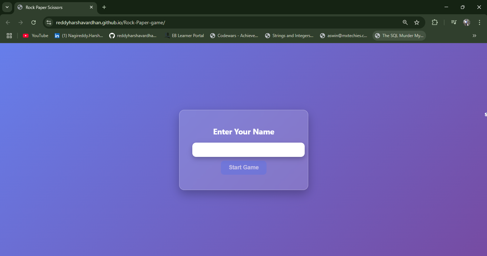
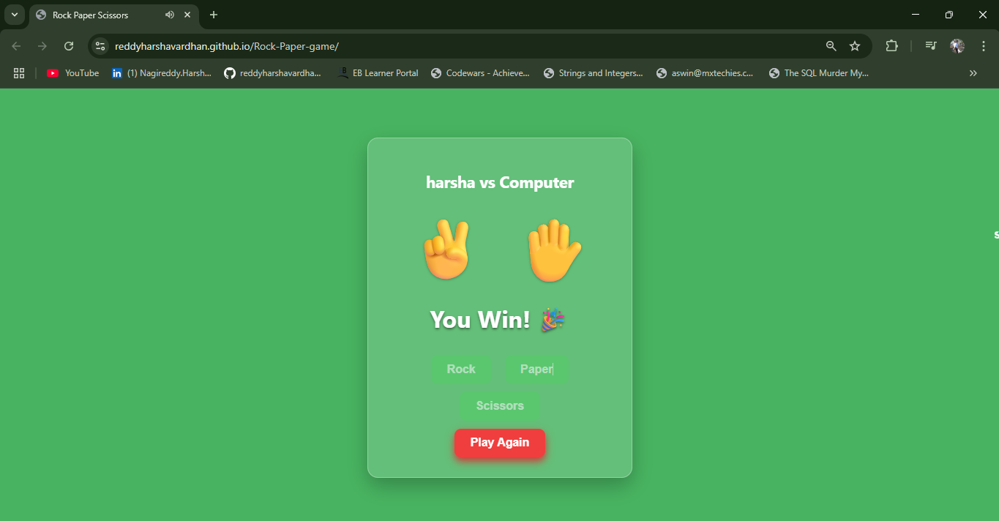
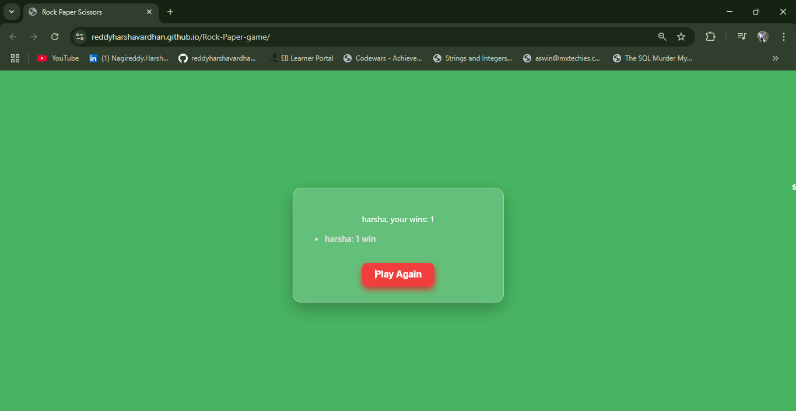

# 🎮 Rock-Paper-Scissors Game

Welcome to an interactive and stylish **Rock-Paper-Scissors** game built with **HTML**, **CSS**, and **JavaScript**. This game includes rich animations, sound effects, and session-based score tracking for multiple players. It's a great showcase of interactive front-end development!

👉 [**Live Demo**](https://reddyharshavardhan.github.io/Rock-Paper-game/) <!-- Replace with your actual live URL -->

---

## 🚀 Features

- 📝 **Name Input & Validation** – Enter your name to start playing.
- 🎮 **Game Logic** – Classic Rock vs. Paper vs. Scissors game with real-time results.
- 🧑‍🤝‍🧑 **Multi-Player Support** – Tracks each player's session wins individually.
- 🔁 **Play Again** – Easily restart with a new or existing player.
- 🎉 **Animations** – Smooth hand-shaking before each round.
- 🔊 **Sound Effects**:
  - Game Start → `start.mp3`
  - Win → `win.mp3`
  - Draw → `draw.mp3`
  - Loss → `fail.mp3`
- 🌈 **Responsive UI** – Fully responsive with color themes and modern layout.

---


## 📸 Screenshots

| Start Screen | Gameplay | Dashboard |
|--------------|----------|-----------|
|  |  |  |

---

## 🛠️ Tech Stack

- HTML5
- CSS3
- JavaScript (ES6)
- Audio APIs
- DOM Manipulation

---

## 📁 Project Structure

```plaintext
rock-paper-scissors/
├── index.html
├── style.css
├── script.js
├── sounds/
│   ├── start.mp3
│   ├── win.mp3
│   ├── draw.mp3
│   └── fail.mp3
└── README.md

💡 Learning Highlights
DOM manipulation and event handling

Game logic implementation

Using animations and transitions

Audio handling in web apps

UI/UX polish and responsive design

